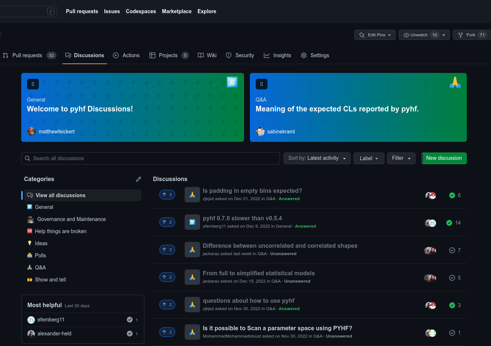

class: middle, center, title-slide
count: false

# .large[How to contribute to pyhf development]

.huge.blue[Matthew Feickert]<br>
.large[(University of Wisconsin-Madison)]
<br>
[matthew.feickert@cern.ch](mailto:matthew.feickert@cern.ch)

[Belle II pyhf Workshop 2023](https://indico.belle2.org/event/8470/contributions/55871/)
<br>
March 3rd, 2023

.middle-logo[]

---
# Introduction and Overview

.huge[
* Most of this talk is just walking you through the [GitHub repo](https://github.com/scikit-hep/pyhf) ⭐ and the [developer webpage](https://scikit-hep.org/pyhf/development.html) 📖
* Want to stress that .bold[contributions do not have to be code]!
   - Questions
   - Documentation improvement
   - Contributing to roadmap discussions
* Contributions of all kinds are welcome and additional maintainers from experiments other than ATLAS would be of interest 👀
]

---
# GitHub Discussions

.kol-2-5.huge[
- Think "Stack Overflow for pyhf specifically"
- Both asking and answering questions helps a lot!
   - .bold[Asking]: Helps us understand what isn't clear, what is tricky
   - .bold[Answering]: Helping out to build community knowledge
]
.kol-3-5[
.center.width-100[[](https://github.com/scikit-hep/pyhf/discussions)]
]

---
# GitHub Issues

.kol-2-5.huge[
- Give direct feedback and make requests
   - Report bugs
   - Propose new features
   - Ask for new documentation and examples
- Feel free to make many of these
]
.kol-3-5[
.center.width-100[[](https://github.com/scikit-hep/pyhf/issues)]
]

---
# GitHub Issues

.kol-2-5.huge[
- Give direct feedback and make requests
   - Report bugs
   - Propose new features
   - Ask for new documentation and examples
- Issue templates exist to help guide you
]
.kol-3-5[
.center.width-100[[](https://github.com/scikit-hep/pyhf/issues)]
]

---
# User Guide / Tutorial

.kol-2-5.huge[
- More in depth walkthrough of the statistical structure of the models and the pyhf APIs
   - All code runnable as user guide built with Jupyter Book!
- .bold[Contribution ideas]:
   - Work through it, open up [GitHub Issues](https://github.com/pyhf/pyhf-tutorial/issues) on .bold[what else you'd like to see], what .bold[needs more clarification]
]
.kol-3-5[
.center.width-100[[](https://pyhf.github.io/pyhf-tutorial/)]
]

---
# Contributing a PR

.kol-2-5.huge[
- First .bold[make sure there is an Issue] that describes the work that needs to be done (make it if it doesn't exist)
- Next .bold[checkout the [`CONTRIBUTING.md`](https://github.com/scikit-hep/pyhf/blob/main/CONTRIBUTING.md)]
- Then .bold[follow the [developer documentation](https://scikit-hep.org/pyhf/development.html)]
]
.kol-3-5[
.center.width-100[[](https://scikit-hep.org/pyhf/development.html)]
]

---
# Contributing a PR

.center.huge.bold[Super quick start]

.huge[
```
# Step 0: Fork the repo
$ python3 -m venv .venv && . .venv/bin/activate
$ git clone git@github.com:<your fork>/pyhf && cd pyhf
$ git checkout origin/main -b feat/my-feature-branch
$ python -m pip install --upgrade pip setuptools wheel
$ python -m pip install --upgrade -e '.[all]'
$ python -m pip install nox
$ nox --session tests --python 3.10  # 3.10 as example
```

.center[Do your work, and push to your fork regularly]
.center[Communicate on relevant Issue and PR]
]

---
# Summary

.large[
- Your contributions are welcome 🎉
- Everything is open and public 🌐
- Hope that you join us 🚀
]

.grid[
.kol-1-3.center[
.circle.width-80[]

[Lukas Heinrich](https://github.com/lukasheinrich)

Technical University of Munich
]
.kol-1-3.center[
.circle.width-80[]

[Matthew Feickert](https://www.matthewfeickert.com/)

University of Wisconsin-Madison
]
.kol-1-3.center[
.circle.width-75[]

[Giordon Stark](https://github.com/kratsg)

University of California Santa Cruz SCIPP
]
]

---
class: end-slide, center

.huge[Backup]

---

class: end-slide, center
count: false

The end.
